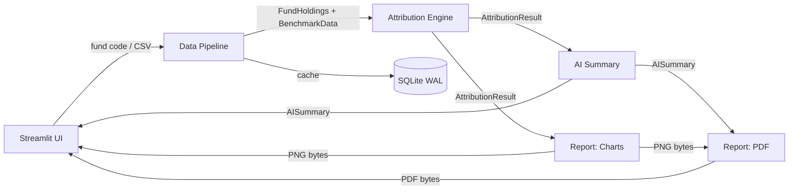
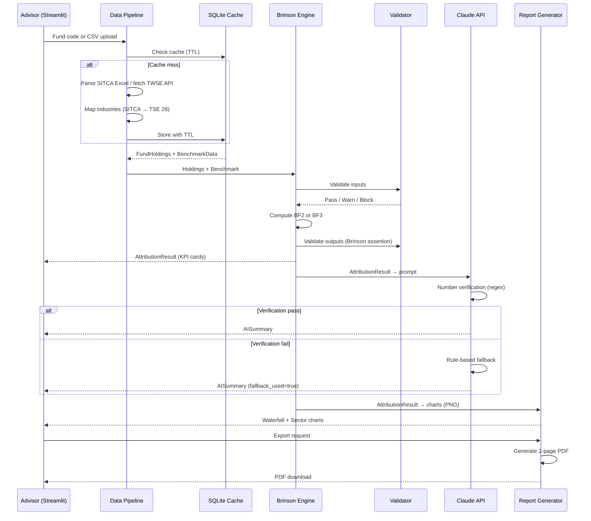

# Architecture — Fund Attribution Analysis MVP

## Domain Model

### Core Domains
- **Fund Data Pipeline**: Ingests fund holding data from SITCA Excel or CSV uploads, maps industries to TSE 28 standard, caches in SQLite. Key entities: FundHoldings (DataFrame), BenchmarkData (dict), IndustryMap.
- **Attribution Engine**: Brinson-Fachler attribution (BF2 two-factor, BF3 three-factor). Takes fund + benchmark data, produces AttributionResult with allocation/selection/interaction effects per industry.
- **AI Summary**: Constructs prompts from attribution results, calls Claude API, verifies numbers via regex, falls back to rule-based template on mismatch. Produces LINE message, PDF summary, and advisor note in Traditional Chinese.
- **Report Generation**: Waterfall chart + sector contribution chart (Matplotlib, CJK fonts), 2-page PDF (fpdf2) with KPIs, narrative, charts, detail table, disclaimer.
- **Presentation**: Streamlit UI for input (fund code or CSV upload), benchmark selection, BF mode toggle, result display (KPI cards, charts, AI tabs), and export (PNG/PDF).
- **Client Management** (v2.0): Multi-client portfolio DB, cross-bank aggregation, KYC risk levels. Key entities: Client, ClientHolding, ClientGoal.
- **Anomaly & Crisis** (v2.0): 6-signal anomaly detection engine, crisis response with historical drawdown comparison. Key entities: AnomalyAlert, CrisisReport.
- **Advisor AI Tools** (v2.0): Morning briefing generator, weekly LINE draft generator, fund comparator with AI explanations. Key entities: MorningBriefing, LineDraft, FundComparison.
- **Goal Planning** (v2.1): Monte Carlo retirement/house goal simulation, 0050 ETF mirror comparison, fee transparency. Key entities: GoalConfig, GoalSimResult, ETFMirrorResult.

### Bounded Contexts


### Aggregate Roots
| Aggregate | Key Entities | Invariants |
|-----------|-------------|------------|
| FundHoldings | industry, weight, return_rate | Weights sum to 1.0 (±0.02), single industry ≤ 60% |
| BenchmarkData | industry → {weight, return, index_name} | Weights sum to 1.0 (exact) |
| AttributionResult | allocation/selection/interaction per industry | alloc + select (+ interaction) = excess_return (< 1e-10) |
| AISummary | line_message, pdf_summary, advisor_note | All numbers in output must match source (0.01% tolerance) |

## System Architecture

### Tech Stack
| Layer | Technology | Version |
|-------|-----------|---------|
| Frontend | Streamlit | ≥1.30 |
| Engine | Python / NumPy / Pandas | 3.11 / ≥1.25 / ≥2.1 |
| Charts | Matplotlib + Noto Sans CJK | ≥3.8 |
| PDF | fpdf2 | ≥2.7 |
| AI | Anthropic Claude API | ≥0.40 |
| Cache/DB | SQLite (WAL mode) | built-in |
| External Data | TWSE OpenAPI (TWT49U, MI_INDEX) | REST/JSON |
| External Data | SITCA FHS/FHW Excel files | Manual upload |
| Deploy | Docker + Nginx + systemd | Python 3.11-slim |

### Data Flow


### Folder Structure
```
├── app.py                  # Streamlit entry point
├── interfaces.py           # Type contracts (Section 8)
├── schema.sql              # SQLite DDL
├── config/settings.py      # Env-based configuration
├── data/
│   ├── sitca_parser.py     # SITCA Excel → DataFrame
│   ├── twse_client.py      # TWSE REST API + rate limiting
│   ├── industry_mapper.py  # SITCA → TSE 28 mapping
│   ├── cache.py            # SQLite CRUD + TTL
│   └── mapping.json        # 30 industry mapping rules
├── engine/
│   ├── brinson.py          # BF2/BF3 attribution math
│   └── validator.py        # Input/output validation
├── ai/
│   ├── prompt_builder.py   # Attribution → Claude prompt
│   ├── claude_client.py    # API call + pipeline
│   ├── number_verifier.py  # Regex % matching
│   └── fallback_template.py# Rule-based Chinese text
├── report/
│   ├── waterfall.py        # Waterfall chart (Matplotlib)
│   ├── sector_chart.py     # Horizontal bar chart
│   └── pdf_generator.py    # 2-page A4 PDF (fpdf2)
└── tests/
    ├── test_golden.py      # Golden dataset verification
    └── golden_data/        # Hand-calculated Excel files
```

## API Contracts

### Internal Module Interfaces (interfaces.py)

| Interface | Input | Output |
|-----------|-------|--------|
| sitca_parser.parse() | Excel file path | `pd.DataFrame[industry, weight, return_rate]` |
| twse_client.fetch_benchmark() | index name, period | `BenchmarkData` (dict[str, dict]) |
| industry_mapper.map() | raw SITCA DataFrame | Mapped DataFrame (TSE 28 standard) |
| cache.get/set() | fund_code, period | Cached data with TTL |
| brinson.compute() | FundHoldings, BenchmarkData, mode | `AttributionResult` |
| validator.validate_input/output() | Holdings / Result | Pass / Warn / Block |
| prompt_builder.build() | AttributionResult | Prompt string |
| claude_client.summarize() | AttributionResult | `AISummary` |
| number_verifier.verify() | AI text, source numbers | bool |
| waterfall.render() | AttributionResult | PNG bytes |
| sector_chart.render() | AttributionResult | PNG bytes |
| pdf_generator.generate() | AttributionResult, AISummary, charts | PDF bytes |

### External APIs

| Method | Endpoint | Purpose | Rate Limit |
|--------|----------|---------|------------|
| GET | `openapi.twse.com.tw/v1/exchangeReport/TWT49U` | Weighted return index | 2s delay |
| GET | `openapi.twse.com.tw/v1/exchangeReport/MI_INDEX` | Industry index returns | 2s delay |

## User Journey Map

### Primary Flow
1. **Input**: Advisor enters fund code OR uploads CSV → selects benchmark → picks BF2/BF3 → clicks "開始分析"
2. **Processing**: Data pipeline fetches/parses → engine computes attribution → AI generates summary → charts rendered
3. **Results**: KPI cards (5 metrics) → Waterfall chart → Sector chart → AI tabs (LINE/PDF/Advisor note)
4. **Export**: Download PNG (waterfall) → Download PDF (full 2-page report with advisor name)

### Key Decision Points
| Step | User Decision | System Response |
|------|--------------|-----------------|
| Input method | Fund code vs CSV upload | SITCA parser vs direct DataFrame |
| Benchmark | Choose index (加權/電子/金融) | Fetch corresponding TWSE data |
| BF mode | BF2 (simpler) vs BF3 (detailed) | Include/exclude interaction effect |
| Export | PNG (quick share via LINE) vs PDF (formal report) | Different output pipelines |

## Product Roadmap Context

### Current Phase
**v2.0** — MVP complete (Sprints 0-4), now entering v2.0 Advisor AI features

### Sprint Plan
| Sprint | Focus | Issues | Status |
|--------|-------|--------|--------|
| 0 | Golden dataset + dev environment | #1, #2 | ✅ Done |
| 1 | Data pipeline (SITCA, TWSE, cache, mapper) | #3, #4, #5, #6, #16 | ✅ Done |
| 2 | Attribution engine + basic UI | #7, #8, #9 | ✅ Done |
| 3 | AI summary + charts + PDF | #10, #11, #12, #13 | ✅ Done |
| 4 | Deploy + QA | #14, #15 | ✅ Done |
| 5 | Client Portfolio DB + Anomaly Detection | #34, #35 | ✅ Done |
| 6 | Morning Briefing + Comparator + Crisis | #36, #37, #39 | ✅ Done |
| 7 | Health Check + LINE Drafts + v2.0 FE | #38, #40, #45 | 🟡 #38/#40 Done, #45 unblocked → FE |
| 8 | Goal Tracker + ETF Mirror + Goal FE | #41, #42, #46 | ✅ Done |
| 9+ | Fee Calculator + Inaction Cost | #43, #44 | 🔵 #44 Ready |

### Recent Decisions
- 2026-04-07: Sprint 6 complete — #36/#39 merged. Unblocked #45 (v2.0 Dashboard FE) + #47 (QA Sprint 5-6)
- 2026-04-07: Sprint 8 complete — #41/#42/#46 all merged. #37/#40 also merged (Sprint 6-7 partial)
- 2026-04-07: Design PR #65 superseded FE PR #58 for Goal Tracker — Design-refined version merged
- 2026-04-07: #36 (Morning Briefing) + #39 (Crisis Response) dispatched to BE — last Sprint 6 items
- 2026-04-07: interfaces.py continues to be merge-conflict hotspot — multiple features add dataclasses
- 2026-04-07: Sprint 5 complete — #34 (Portfolio DB) + #35 (Anomaly Detection) both merged
- 2026-04-07: #35 merge unblocked #36 (Morning Briefing) and #39 (Crisis Response) for Sprint 6
- 2026-04-07: #46 (Goal Tracker FE) routed to Design for visual review after QA code approval
- 2026-04-07: v1.1.2 Feature Registry decomposed into 14 issues (#34-#47) across Sprints 5-9+
- 2026-04-07: F-201 (Portfolio DB) is critical path — all v2.0 features depend on it
- 2026-04-07: BE+FE features split: BE builds engine, single FE task (#45) wires all v2.0 dashboard UI
- 2026-04-07: F-304 (Inaction Cost) has no deps — ready immediately as standalone sales tool
- 2026-04-07: External market data (PE, RSI, fund flows) stubbed in F-202 — real integration deferred
- 2026-04-07: MoneyDJ scraping (DS-05) deferred — HIGH risk, use SITCA/TWSE only for now
- 2026-04-06: All 16 MVP issues delivered (Sprints 0-4)
- BF2 as default mode, BF3 opt-in (simpler first experience for advisors)
- SITCA data via manual Excel upload (no web scraping in MVP)
- Number verification (regex) as AI hallucination guard — fallback to rule-based template

### Known Tech Debt
| Item | Impact | Priority |
|------|--------|----------|
| No auth / multi-user | Single advisor assumed | Medium (needed for v2.0 client features) |
| External market data stubs in F-202 | PE/RSI/flow signals non-functional | Medium (needs data source) |
| MoneyDJ integration deferred | Fund NAV history unavailable | Low (scraping risk) |
| Hardcoded benchmark options (3) | Limited coverage | Low |
| No E2E test coverage | Regression risk on integration | Medium |

### Planned Features (v2.0 → v2.1)
| Feature | Issue | Domain Impact | Dependencies | Sprint |
|---------|-------|--------------|-------------|--------|
| Client Portfolio DB | #34 | New `clients` + `client_portfolios` tables | F-104 (done) | 5 |
| Anomaly Detection | #35 | 6 signal types, `anomaly_alerts` table | #34 | 5-6 |
| Morning Briefing | #36 | Daily digest + talking points | #34, #35 | 6 |
| Fund Comparator | #37 | Side-by-side Brinson + AI explanation | F-101 (done) | 6 |
| Cross-Bank Health Check | #38 | Multi-bank aggregation, risk-KYC check | #34 | 7 |
| Crisis Response | #39 | Market crash detection + 安撫話術 | #34, #35 | 7 |
| Weekly LINE Drafts | #40 | Personalized client messages | #34 | 7 |
| Goal Tracker (BE) | #41 | Monte Carlo simulation, `client_goals` table | #34 | 8 |
| ETF 0050 Mirror | #42 | Portfolio vs 0050 comparison | #34 | 8 |
| Fee Calculator | #43 | TER computation + alternatives | #34 | 9+ |
| Inaction Cost (FE) | #44 | Standalone inflation erosion chart | None | 9+ |
| v2.0 Dashboard FE | #45 | Briefing+Anomaly+Crisis+Comparator+Health UI | #35-#39 | 7-8 |
| Goal Tracker FE | #46 | Monte Carlo fan chart + goal CRUD | #41 | 8 |
| QA Sprint 5-6 | #47 | Verification of #34-#37 | #34-#37 | 6 |

## Failure Modes

| Service Boundary | Failure | Detection | Recovery | User Impact |
|-----------------|---------|-----------|----------|-------------|
| TWSE API | Rate limited / down | HTTP 429/5xx | 24h SQLite cache + fallback CSV | Stale data (acceptable for monthly analysis) |
| SITCA Excel | Corrupted / wrong format | Parser validation | Error message to user | Must re-upload |
| Industry Mapping | Unmapped categories | unmapped_weight check | ≥10% → block analysis, <10% → warn | Partial attribution (with warning) |
| Brinson Assertion | Effects don't sum to excess | Tolerance check (1e-10) | Block result, show error | No output (data integrity protected) |
| Claude API | Timeout / error | 10s timeout | Rule-based fallback template | Slightly less natural summary |
| AI Hallucination | Numbers in summary ≠ source | Regex number verification | Auto-switch to fallback | Correct numbers guaranteed |
| SQLite | DB locked / corrupted | WAL mode + busy_timeout | 5s retry, then fail gracefully | Temporary service interruption |
| PDF/Chart | CJK font missing | Font path check | Docker image includes fonts-noto-cjk | Broken characters (deploy issue) |
